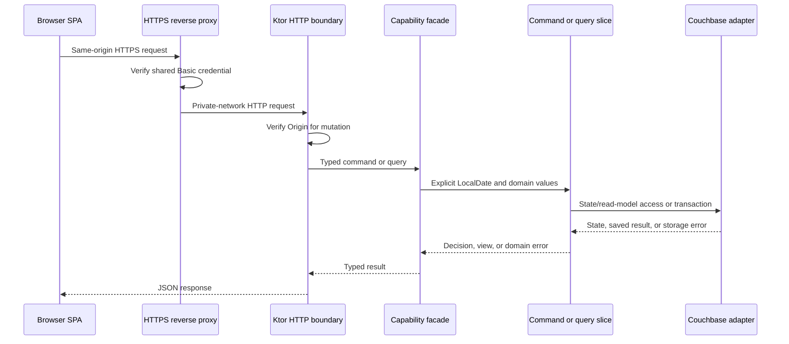

# Tech spec — CHG-001

## Current State (required)

Verified directly against the repository on 2026-09-04.

- Files in scope are `CONTEXT.md`, `docs/specs/CHG-001/product.md`, this specification, the accepted ADRs under `docs/adr/`, and the templates under `docs/spec-templates/`.
- No application source, build configuration, dependency manifest, API schema, database schema, migration, test, deployment configuration, or operational script exists.
- No Dashboard, Tasks, Habits, access boundary, persistence, contract, or web behavior exists.
- ADRs 0001 through 0007 record accepted greenfield decisions; no implementation predates them.
- `docs/specs/CHG-001/plan.md` exists as a downstream draft produced from the earlier technical specification and must be regenerated after this revision.
- The repository is not initialized as a Git repository.

## Architecture Delta (required)

Build one monorepo containing `apps/server`, `apps/web`, `core/tasks`, `core/habits`, and `contracts/openapi.yaml`. CHG-001 does not create an Android application, but the Tasks and Habits core modules are built for later reuse by the offline-first Android client.

The responsive React/TypeScript SPA and `/api/v1` share one HTTPS origin. An existing user-operated reverse proxy is the only browser-facing endpoint and requires one shared HTTP Basic Auth credential for the entire origin. It rejects unauthenticated requests before forwarding and strips the `Authorization` header. The reverse proxy is co-located on the home-server host. Compose publishes the Kotlin/JVM application listener only on an operator-selected `127.0.0.1` host socket, and the proxy forwards to that exact loopback socket. LAN interfaces never bind the application listener. Couchbase Server runs separately in the same Compose project and is reachable only through the private Compose data network. A future Android change adds a self-hosted Sync Gateway as the mobile sync boundary; it does not connect Couchbase Lite directly to Couchbase Server.

The backend has two owning product capabilities:

- **Tasks** owns Anytime and Fixed-day task lifecycle, effective-dated status transitions, date visibility, its Couchbase collection, its Dashboard card read model, and the composite Tasks-board endpoint.
- **Habits** owns Habit definitions, Habit occurrences, progress, archives, Completion rate, per-Habit Target attainment, its Couchbase collections, and its Dashboard card read model and endpoint.

There is no backend Dashboard module. The React Dashboard independently loads the Tasks and Habits summary endpoints. A query-only `daily-overview` module may be introduced later if cross-capability or materially more complex projections justify dedicated storage and synchronization.

Each infrastructure-free Kotlin/JVM capability module targets JVM 17 and exposes one small public facade, including the port contracts needed by runtime adapters. Command and query paths are logically separate vertical slices inside the capability; they are not separate Gradle modules. All other domain policies, handlers, and implementations remain internal. Ktor handlers call the facades, Couchbase adapters implement their storage/query ports, and neither HTTP nor database types enter the core.

The Tasks board is an intentional one-way composition exception: its query handler calls the public Habits query facade for due day-based occurrences and maps both capability results into one board response. Tasks never reads Habit collections or imports Habit internals. If either query fails, the composite request fails; partial board responses are not returned.

Task-to-Habit conversion can otherwise create a fractured composite read if it commits between the Tasks and Habits queries. The Tasks capability therefore owns one `TaskBoardCompositionRevision` document. Every successful conversion increments it in the same transaction as the Task and Habit changes. A board query reads the revision before and after its two `REQUEST_PLUS` capability queries and returns only when the values match. A changed revision causes a bounded full-query retry; exhausting that retry returns `503 STORAGE_UNAVAILABLE` rather than a mixed board. Conversion is the only CHG-001 mutation that changes both board sources atomically, so other Task-only or Habit-only mutations do not increment this revision.

CQRS is state-based. Commands load and validate aggregate state, use CAS or a transaction for writes, and return explicit results. Habit progress mutations transactionally read the owning Habit and the deterministic progress document so lifecycle changes and stale occurrence versions cannot race. Habit deletion uses the same transaction boundary to validate projected history, query progress history, and delete the Habit. Queries use purpose-built read models and query ports without reconstructing command aggregates when that is unnecessary. Current documents, immutable Habit definition versions, and progress records are the source of truth; no event store or asynchronous projection system is introduced.

The pure policy code accepts explicit `LocalDate` and period values and never reads the server clock. The facade boundary supplies caller-generated Task, Habit, and Habit definition-version IDs plus explicit dates so retries and future offline execution remain deterministic.

Every caller-generated ID is parsed and serialized as a canonical lowercase, hyphenated UUID before it reaches a facade or document-key function. Non-canonical textual forms are rejected with `422 VALIDATION_FAILED`; the application never creates distinct keys for equivalent UUID values.

The browser sends its current Local calendar key whenever an operation depends on Today. Creation and update timestamps remain UTC instants for concurrency and diagnostics, but never decide which day, week, or month owns a Task or Habit occurrence.

The SPA consumes a generated TypeScript client from the canonical OpenAPI contract at `contracts/openapi.yaml`. HTTP schemas remain separate from core types. A future Android client will use Couchbase Lite Community Edition as its local document database and the Couchbase Lite Replicator against a self-hosted Sync Gateway. It will not use Room or SQLite as the primary persistence system and will not require a hand-written change-journal protocol for ordinary document replication. Android, local mobile persistence, synchronization, and conflict resolution are not implemented here.

The future Android architecture is constrained as follows:

- Android UI commands and queries execute against Couchbase Lite and do not wait for network access.
- The Couchbase Lite replicator durably queues document changes and resumes push/pull synchronization after connectivity returns.
- Syncable documents use deterministic IDs, caller-generated command or operation IDs, explicit deletion markers, and a deliberate conflict resolver. Default last-write-wins behavior is not sufficient for Task status, Habit definitions, progress, or conversion semantics.
- Sync Gateway supplies mobile authentication, collection/channel scope, and replication. It does not replace GYTT domain validation or server-side transaction rules.
- Android must not write the same canonical documents through both Sync Gateway and the Ktor mutation API without an explicitly tested write-ownership rule.
- Task-to-Habit conversion and other multi-document operations must either replicate one atomic command document for server-side transactional application or use a tested mergeable canonical-document model. Replication of two documents does not preserve a Couchbase transaction.
- The server remains the synchronization authority after reconciliation. These rules do not make the MVP event-sourced and do not add Android sync endpoints or storage in CHG-001.

All writes use Couchbase Java SDK durability `MAJORITY_AND_PERSIST_TO_ACTIVE`. Kotlin uses one singleton Java SDK `Cluster` and transaction manager because the Kotlin SDK does not implement transactions itself. Transaction lambdas contain no external side effects because Couchbase may retry them.

Every user-facing SQL++ query uses `REQUEST_PLUS` scan consistency. Known-ID KV reads remain the preferred path. This makes an acknowledged Task, Habit, or progress mutation visible to an immediately following board, summary, history, or metrics request without requiring a browser-held mutation token. The 500 ms query objective is measured with this consistency level.

An SDK result classified as an unambiguous failure maps to the relevant domain or storage error. Any timeout after a durable mutation or transaction has been dispatched is treated as potentially ambiguous because Couchbase may still complete work after the client-side deadline. When the remaining Ktor request budget permits, the application performs one bounded KV read-back of the deterministic document IDs and compares current state with the exact requested postcondition. It returns the normal success response only when that postcondition is proven; otherwise it returns `503 COMMIT_UNKNOWN`. If the Ktor deadline itself expires before a response can be written, the client treats the transport failure as indeterminate, reloads, and reuses the same deterministic IDs before retrying.

Internal Couchbase KV, SQL++, transaction, ambiguity-read-back, and Ktor request deadlines are explicit configuration values. Startup requires the Ktor deadline to exceed the longest applicable Couchbase deadline plus the read-back allowance and a fixed application margin. The reverse proxy deadline is external and cannot be validated by Ktor; the operator runbook records and tests that it exceeds the Ktor deadline plus a network margin. Request cancellation prevents new application work but does not claim to cancel work already accepted by Couchbase.

Permanent deletion replaces a Task or unused Habit aggregate with a content-free consumed-ID receipt at the same deterministic key. The receipt retains only entity kind, canonical ID, deletion revision, and deletion timestamp; it retains no title, details, status history, definitions, progress, or other personal content. A later create using that ID returns `409 ID_REUSED`, including a delayed retry of the original create. Ambiguous deletion succeeds only when read-back proves the consumed-ID receipt, not merely when the aggregate is absent.

Task-to-Habit conversion is the only operation that atomically changes two capabilities. A thin application workflow coordinates the Tasks and Habits facades through an abstract unit-of-work boundary and contains no independent business policy. The caller supplies the new Habit ID and initial definition-version ID. The Couchbase transaction inserts that Habit and appends a Completed transition to the source Task with a reference. A backdated conversion before a later Task completion uses the same explicit later-log confirmation as a status mutation and removes those logs inside the transaction. After an ambiguous commit, the application reads both deterministic document IDs: it returns success only if both contain the requested result; otherwise it returns `COMMIT_UNKNOWN`, and the SPA reloads before offering a same-ID retry.

`convertedHabitId` is write-once. Reopening a converted Task changes only its effective-dated status and does not make it convertible again. A later conversion request succeeds idempotently only when it repeats the original Habit and initial definition-version IDs and the existing Habit still represents that conversion; any different conversion returns `409 TASK_ALREADY_CONVERTED` without changing either aggregate or the board-composition revision.



The confirmed test seams are:

1. **Capability facade seam** for Task and Habit commands and queries with in-memory ports, including calendar behavior, visibility, copy policy, consumed-ID receipts, conversion guards, recurrence, progress, history, metrics, and shared progress updates.
2. **Cross-capability application seam** for atomic Task-to-Habit conversion and the bounded Tasks-board composition-revision protocol.
3. **HTTP and OpenAPI seam** for canonical UUIDs, Task-by-ID conflict reload, validation, errors, request limits, deadline mapping, and mutation Origin enforcement.
4. **Persistence seam** for real Couchbase provisioning, identity receipts, indexes, CAS, transactions, board revision fencing, read-after-write consistency, ambiguity reconciliation, history, schema compatibility, and restart durability.
5. **Frontend component seam** for Task conflict reload, standard-Task copy and conversion states, browser reload, accessibility, and retry/error behavior.
6. **Operator deployment seam** for the real reverse proxy, timeout ordering, authentication and network isolation, browser and service restart, backup, compatible rollback, and incompatible-schema restore.

Per the confirmed test boundary, CHG-001 does not add automated browser or reverse-proxy tests. Vitest and Testing Library cover frontend behavior below the browser level. Reverse-proxy behavior, real-browser Basic Auth, responsive layout, and runtime network confinement remain operator acceptance checks against the built deployment.

## Architecture Decisions

- [0001 — Use self-hosted Couchbase](../../adr/0001-use-self-hosted-couchbase.md)
- [0002 — Use local calendar keys](../../adr/0002-use-local-calendar-keys.md)
- [0003 — Version habit definitions](../../adr/0003-version-habit-definitions.md)
- [0004 — Use a reverse-proxy Basic Auth boundary](../../adr/0004-use-reverse-proxy-basic-auth-boundary.md)
- [0005 — Use a shared Kotlin/JVM capability core](../../adr/0005-use-shared-kotlin-jvm-capability-core.md)
- [0006 — Keep Dashboard summaries source-owned](../../adr/0006-keep-dashboard-summaries-source-owned.md)
- [0007 — Use effective-dated Task board status](../../adr/0007-use-effective-dated-task-board-status.md)
- [0008 — Use a feature-first web application structure](../../adr/0008-use-feature-first-web-structure.md)
- [0009 — Isolate generated web code](../../adr/0009-isolate-generated-web-code.md)
- [0010 — Use Couchbase Mobile for offline sync](../../adr/0010-use-couchbase-mobile-for-offline-sync.md)

## Backend

### Operations

`contracts/openapi.yaml` is the canonical wire contract. API responses use JSON except empty `204` responses and errors, which use `application/problem+json`. IDs are caller-generated canonical lowercase, hyphenated UUID strings; other textual UUID forms are rejected rather than normalized silently. Local dates are `YYYY-MM-DD`, an ISO week is `YYYY-Www` using the ISO week-based year, a month is `YYYY-MM`, timestamps are RFC 3339 UTC instants, and decimal values are canonical non-negative strings with at most 12 integer and 6 fractional digits.

Every error contains:

- `type: string` — stable `urn:gytt:error:<code>` identifier.
- `title: string` — stable summary.
- `status: integer` — HTTP status.
- `detail: string` — safe user-facing detail with no secret or database content.
- `code: string` — stable machine code.
- `fields: Record<string, string> | null` — field validation messages.
- `traceId: string` — local log correlation ID.

Common application errors are `MALFORMED_REQUEST` (`400`), `ORIGIN_REJECTED` (`403`), `NOT_FOUND` (`404`), `VERSION_CONFLICT`, `ID_REUSED`, `LATER_TASK_STATUS_EXISTS`, `TASK_ALREADY_CONVERTED`, or `HABIT_HAS_HISTORY` (`409`), `VALIDATION_FAILED` or `INVALID_CALENDAR_OPERATION` (`422`), and `STORAGE_UNAVAILABLE`, `TRANSACTION_FAILED`, or `COMMIT_UNKNOWN` (`503`). The reverse proxy owns Basic Auth failures and returns `401` with `WWW-Authenticate`; that response is outside the application problem contract.

Titles contain 1–200 Unicode code points after trimming, details at most 5,000, and units at most 32. Oversized values return `422`; a request body over 64 KiB returns `413 PAYLOAD_TOO_LARGE`.

Shared schemas:

- `TaskInput` is either `{ id: UUID, type: "anytime", title: string, details: string | null, startDate: LocalDate }` or `{ id: UUID, type: "fixedDay", title: string, details: string | null, fixedDate: LocalDate }`.
- `TaskStatus` is `"todo"`, `"inProgress"`, or `"completed"`.
- `TaskView` adds `status: TaskStatus`, `statusEffectiveDate: LocalDate`, `convertedHabitId: UUID | null`, and `version: string`. List views resolve status for their requested date and do not include the full transition history.
- `TaskRecordView` is the date-independent record used for details and conflict recovery: `{ id, type, title, details, startDate, fixedDate, latestStatus, latestStatusEffectiveDate, convertedHabitId, version }`. It does not expose the full transition history.
- `Schedule` is `{ type: "daily" }`, `{ type: "selectedDays", isoWeekdays: integer[] }`, `{ type: "weekly" }`, or `{ type: "monthly" }`. ISO weekdays are unique integers `1..7`, Monday first.
- `Target` is `{ type: "binary" }` or `{ type: "numeric", amount: DecimalString, unit: string | null }`; numeric amount is greater than zero.
- `HabitDefinitionInput` is `{ id: UUID, effectiveDate: LocalDate, schedule: Schedule, target: Target }`.
- `HabitInput` is `{ id: UUID, title: string, details: string | null, definition: HabitDefinitionInput }`.
- `HabitView` is `{ id: UUID, title: string, details: string | null, startedOn: LocalDate, archivedFrom: LocalDate | null, currentDefinition: { id: UUID, effectiveDate: LocalDate, schedule: Schedule, target: Target }, version: string }`.
- `PeriodRef` is `{ type: "day", key: LocalDate }`, `{ type: "week", key: IsoWeek }`, or `{ type: "month", key: YearMonth }`; `IsoWeek` is a canonical `YYYY-Www` string.
- `Progress` is `{ type: "binary", touched: boolean, done: boolean }` or `{ type: "numeric", amount: DecimalString }`.
- `HabitOccurrenceView` is `{ habitId: UUID, title: string, period: PeriodRef, target: Target, progress: Progress, status: "untouched" | "partial" | "done" | "missed", percentage: DecimalString | null, version: string }`. The opaque occurrence version covers the current Habit revision, resolved definition-version ID, and progress revision or absence.
- `TaskBoardItem` is `{ type: "task", task: TaskView }` or `{ type: "habitOccurrence", occurrence: HabitOccurrenceView }`.
- `TaskBoardView` is `{ date: LocalDate, todo: TaskBoardItem[], inProgress: TaskBoardItem[], completed: TaskBoardItem[] }`. Untouched Habit occurrences map to To do, partial numeric occurrences map to In progress, and done occurrences map to Completed; missed occurrences are not due on a later board.
- `TaskDaySummary` is `{ date: LocalDate, completed: integer, remaining: integer }` and counts standard Tasks only; remaining combines To do and In progress.
- `HabitDaySummary` is `{ date: LocalDate, completed: integer, total: integer, completionPercentage: DecimalString | null, incomplete: HabitOccurrenceView[] }`.

Access boundary and health operations:

- The reverse proxy challenges every request for the SPA and `/api/v1` with HTTP Basic Auth. The Kotlin application exposes no sign-in, sign-out, account, or session operation.
- `GET /health/live` returns `200` while the JVM can serve requests and reveals no configuration, versions, counts, or credential state.
- `GET /health/ready` returns `200 { ready: true }` only after configuration, Couchbase, matching migration checksums, image/schema compatibility, disabled usage sharing, and a bounded database check succeed; otherwise it returns `503 { ready: false }`.
- Health operations are available only to container-local checks and the private deployment network; the reverse proxy does not publish them.

Read operations:

- `GET /api/v1/tasks/summary?date={LocalDate}` returns `TaskDaySummary`.
- `GET /api/v1/habits/summary?date={LocalDate}` returns `HabitDaySummary`. Habit percentage is null when none is scheduled.
- `GET /api/v1/tasks/{taskId}` returns `TaskRecordView` even when the Task is not visible on the currently selected board. A consumed-ID receipt is not a Task and returns `404 NOT_FOUND`.
- `GET /api/v1/tasks?date={LocalDate}` returns `TaskBoardView`. The Tasks query reads the board-composition revision, supplies standard Tasks, calls the Habits query facade for daily and due selected-day occurrences, and reads the revision again. Weekly and monthly occurrences are excluded. Failure of either capability fails the whole request with `503 STORAGE_UNAVAILABLE`; a changed revision retries the entire composite read within a bounded budget, and exhaustion returns the same retryable error without a mixed board.
- `GET /api/v1/habits/{habitId}?asOf={LocalDate}` returns one `HabitView` whose current definition is resolved for `asOf`.
- `GET /api/v1/habit-occurrences?periodType={day|week|month}&periodKey={key}&asOf={LocalDate}` returns `period`, `incomplete`, and `completed`. A past incomplete occurrence is missed while retaining recorded partial progress.
- `GET /api/v1/habits/{habitId}/metrics?from={LocalDate}&to={LocalDate}&asOf={LocalDate}` returns `expected`, `completed`, `completionPercentage`, `targetAttainment: { percentage, unit } | null`, and `targetAttainmentReason: null | "binaryTarget" | "noOccurrences" | "mixedUnits"`. Target attainment is uncapped and is calculated only for one numeric Habit whose selected definitions share a unit.

All reads are reachable only after reverse-proxy authentication and return `422 VALIDATION_FAILED` for invalid calendar/range values and `503 STORAGE_UNAVAILABLE` when Couchbase cannot complete the read. SQL++ read models use parameter binding and `REQUEST_PLUS`; an unbindable value is rejected rather than concatenated or silently downgraded to weaker consistency.

Task mutations:

- `POST /api/v1/tasks` creates `TaskInput` and returns `201 TaskView`. An identical same-ID retry returns `200` while the Task still exists; different content or a consumed-ID receipt for that ID returns `409 ID_REUSED`.
- `PUT /api/v1/tasks/{taskId}` accepts `TaskInput` plus `version`; IDs must match. It returns `200 TaskView`. Status history remains unchanged, and an Anytime Task's start date cannot move after an existing transition.
- `PUT /api/v1/tasks/{taskId}/status` accepts `status: TaskStatus`, `effectiveDate: LocalDate`, `clientToday: LocalDate`, `discardLaterTransitions: boolean`, and `version: string`; returns `200 TaskView`. Any state-to-state movement is allowed. For Anytime Tasks, `effectiveDate` is the selected board date and cannot precede start. For Fixed-day Tasks, it must equal the fixed date even when corrected later.
- Status changes append an effective-dated transition and retain earlier logs. Repeating the same desired status for the same effective date is idempotent. If an Anytime Task is completed before a later completion, `discardLaterTransitions: false` returns `409 LATER_TASK_STATUS_EXISTS`; after UI confirmation, the same request with `true` removes all later status logs and applies the earlier completion. Other historical transitions preserve later logs.
- `DELETE /api/v1/tasks/{taskId}?version={version}` permanently removes the Task's personal content and replaces it with a consumed-ID receipt, then returns `204`. UI confirmation is required before calling. An identical retry against the receipt returns `204`; the receipt prevents delayed create retries from reviving the Task.
- `POST /api/v1/tasks/{taskId}/convert-to-habit` accepts `taskVersion`, `completionDate`, `discardLaterTransitions`, and `habit: HabitInput`; returns `200 { task, habit }`. The caller supplies the Habit and initial definition-version IDs. The transaction inserts the Habit, completes and references the Task, and increments the Tasks-board composition revision. An identical retry using the original IDs returns the converted result without another revision increment. If `convertedHabitId` already names a different conversion, the response is `409 TASK_ALREADY_CONVERTED`. If conversion backdates completion before a later completion, false returns `409 LATER_TASK_STATUS_EXISTS`; true removes later logs atomically with conversion. A known rollback returns `503 TRANSACTION_FAILED`; an unresolved ambiguous commit returns `503 COMMIT_UNKNOWN`.

Habit mutations:

- `POST /api/v1/habits` creates `HabitInput` and returns `201 HabitView`. The UI defaults `definition.effectiveDate` to Today, but it is explicit on the wire. The caller supplies both Habit and initial definition-version IDs. An identical retry of either ID returns the created Habit while it exists; reuse with different content or a consumed-ID receipt for that Habit ID returns `409 ID_REUSED`.
- `PUT /api/v1/habits/{habitId}` accepts `version`, `clientToday`, `title`, `details`, and `definition: HabitDefinitionInput | null`; returns `200 HabitView`. `definition` is null for a title/details-only edit. A new definition ID is required when schedule, target, or effective date changes. Effective date cannot precede Today. Repeating an already-applied definition ID with identical content is idempotent even when the supplied aggregate version is stale; different content for that ID returns `409 ID_REUSED`.
- An open occurrence with no progress may be replaced or removed by a definition effective in its open period. When progress exists, the change must continue to produce the same `PeriodRef`, keep the same target kind, and, for numeric targets, keep the same unit. A compatible numeric target amount may change and retains the absolute progress. A cadence, applicability, target-kind, or unit change that would reinterpret or orphan open progress returns `422 INVALID_CALENDAR_OPERATION`; the user may choose a later effective date after that occurrence closes. Closed periods always retain their earlier definition.
- `PUT /api/v1/habit-occurrences/{habitId}/{periodType}/{periodKey}/progress` accepts absolute `progress`, `clientToday`, and non-null `version`; returns `200 HabitOccurrenceView`. The transaction reads the Habit and progress documents, validates the complete occurrence token against the resolved definition and archive state, and then writes progress. Increment/decrement controls submit the resulting absolute amount, making retries idempotent. Numeric zero is untouched, a positive amount below target is partial, and target or above is done. Amount cannot be negative.
- `PUT /api/v1/habits/{habitId}/archive` accepts `fromDate`, `clientToday`, and `version`; returns `200 HabitView`. Date cannot precede Today; no occurrence is expected on or after it.
- `DELETE /api/v1/habits/{habitId}?version={version}&clientToday={LocalDate}` transactionally returns `204` only when the Habit has no occurrence history. Occurrence history exists when at least one applicable occurrence has begun on or before `clientToday` or any progress document exists. Otherwise it returns `409 HABIT_HAS_HISTORY`. The transaction reads the Habit, derives its first applicable occurrence, queries progress by Habit ID, and replaces the Habit with a consumed-ID receipt; a concurrent progress mutation reads the same Habit and cannot commit against the deleted lifecycle state. An identical retry against the receipt returns `204`.

Idempotency is checked against current stored state before returning a version conflict only for the same deterministic operation. A repeated create or definition-version ID must have identical content, and a consumed entity ID can never be reused. A repeated status or archive must already contain the exact requested effective state. A repeated absolute-progress request may return success with an older progress revision only when the Habit revision and resolved definition ID still match and current progress already equals the requested value. A repeated conversion must name the Task's existing converted Habit and original definition-version ID. Other stale tokens return `409 VERSION_CONFLICT`.

All mutations are reachable only after reverse-proxy authentication and require an `Origin` exactly equal to `GYTT_PUBLIC_ORIGIN`. They return the common origin, validation, not-found, version conflict, storage, and ambiguous-outcome errors where applicable. A normal response is not returned after an ambiguous SDK result until deterministic read-back proves the requested postcondition. Task and Habit deletes are proven by their consumed-ID receipts. These are all new operations, so there is no existing caller compatibility promise.

### Events

There are no external or internal event contracts in this change.

## Frontend

The web source layout follows [ADR 0008](../../adr/0008-use-feature-first-web-structure.md)
and generated-code placement follows [ADR 0009](../../adr/0009-isolate-generated-web-code.md):
`app/` owns bootstrap and routing, `pages/` owns route-level composition,
`features/` keeps capability code together, and `shared/` contains
capability-neutral infrastructure. All generated artifacts belong under
`shared/generated/`; feature API adapters remain under their owning feature.
Prettier and oxlint ignore that directory recursively.

### Screens and routes

- `/` — Dashboard, served only after the browser satisfies the reverse proxy's Basic Auth challenge.
- `/tasks` — derives the device Today and replaces the URL with `/tasks/:date`.
- `/tasks/:date` — Tasks for a `LocalDate`; Today comes from the device.
- `/habits/day`, `/habits/week`, and `/habits/month` — derive the device's current day, Monday-based ISO week, or calendar month and replace the URL with the corresponding keyed route.
- `/habits/day/:date` — day-based Habits view.
- `/habits/week/:isoWeek` — weekly view using a canonical `YYYY-Www` ISO week key.
- `/habits/month/:month` — monthly view.
- `/habits/{periodType}/{periodKey}/habit/:habitId` — Habit details and history, rendered as a side panel over the encoded period on wide screens and as a full page on narrow screens.
- `/habits/{periodType}/{periodKey}/habit/:habitId/edit` — effective-dated edit and archive in the same responsive surface.

Habit creation is local modal state over the current period and has no route. Closing the modal leaves the period URL unchanged.

Unknown, malformed, or impossible calendar route values show a not-found state with links to Dashboard and Today; they are not silently normalized.

### Components

All components are internal and have no existing caller compatibility surface.

- `AppShell(children: ReactNode)` owns navigation.
- `DashboardPage(today: LocalDate)` renders a static greeting and starts the Tasks and Habits summary queries independently.
- `TaskSummaryCard(summary: TaskDaySummary | null, state, onRetry)` owns its loading, error, and retry presentation.
- `HabitSummaryCard(summary: HabitDaySummary | null, state, onRetry)` owns its loading, error, and retry presentation.
- `TasksPage(date: LocalDate)` owns the selected date, the composite Task-board query, and the local Task-modal state.
- `TaskBoard(view: TaskBoardView, selectedDate: LocalDate)` renders the three status columns and coordinates accessible card movement.
- `TaskColumn(status: TaskStatus, items: TaskBoardItem[])` retains its heading and empty body when it has no cards.
- `StandardTaskCard(task: TaskView, onOpen, onMove)` supports pointer drag-and-drop and the equivalent keyboard-accessible Move action.
- `HabitTaskCard(occurrence: HabitOccurrenceView, onOpen, onSetProgress)` renders distinct Habit styling and inline progress; its column is derived from progress and cannot be changed by dragging.
- `TaskModal(item: TaskBoardItem | null, mode, onSaved, onClose)` owns the standard Task create/details/edit/copy/convert/delete workflows or shows simple Habit occurrence details and a link to the matching Habits period. Copy is available for any standard Task; the explicit product path for a non-completed historical Fixed-day Task remains supported.
- `TaskEditor(initial: TaskView | TaskRecordView | null, defaultDate: LocalDate, onSaved, onCancel)` owns draft state and renders discriminated Anytime/Fixed-day fields.
- `HabitsPage(period: PeriodRef, asOf: LocalDate)` owns the period query and navigation.
- `HabitCreateModal(period: PeriodRef, onSaved, onClose)` owns local creation state and does not change the route.
- `HabitDetailsPanel(habitId, period, mode)` owns details, history, metrics, effective-dated editing, archive, and delete actions; responsive layout changes do not change its route.
- `HabitEditor(initial: HabitView | null, clientToday: LocalDate, onSaved, onCancel)` owns draft schedule, target, and effective date.
- `HabitProgressControl(occurrence: HabitOccurrenceView, onSet)` renders a binary toggle or numeric increment-by-one, decrement-by-one, and absolute entry.
- `CompletedSection(title: string, count: number, defaultExpanded: boolean, children: ReactNode)` owns only expanded/collapsed state.
- `MetricSummary(completionPercentage, targetAttainment, reason)` renders per-Habit metrics and never a mixed-unit aggregate.

All pages and controls render on the client. Server data is owned by route-level query state; editors own only unsaved drafts, and domain records are never duplicated into a global client store.

### States

- Before SPA delivery, the browser displays its native Basic Auth prompt when no valid cached credential exists.
- Initial application load shows bounded skeletons, then content or a full-page local-service error.
- Dashboard begins with a static non-personalized greeting. Empty Dashboard Tasks shows zero completed and remaining. Empty Dashboard Habits shows “No habits scheduled today,” no percentage, and no unfinished items.
- A failed Dashboard card request leaves the other card visible and gives only the failed card a retry action.
- An empty Tasks board preserves all three column headings and renders no message, placeholder, or create action inside their bodies. Task creation remains available in the page controls.
- On narrow screens, the Tasks columns remain side by side in one horizontally scrollable, snap-aligned board region. The application shell and page do not overflow horizontally.
- Standard Task cards can be dragged between columns. Every drag operation has an equivalent keyboard-accessible Move action, visible focus, and announced result.
- Backdating completion before a later completion opens a warning dialog. No mutation occurs until the user confirms deletion of later status logs.
- A failed composite Tasks-board query replaces the board with one retryable error; partial rows are never shown.
- Empty Habits views explain the selected period and provide the create action.
- The Habits Completed section is collapsed by default, shows its count, and is keyboard-expandable.
- Habit progress controls remain inline in the period list. The create modal returns focus to its trigger; the details/edit panel returns focus to its originating Habit card.
- During mutation, only the affected control is disabled; navigation and unrelated items remain usable.
- Validation stays in the editor, preserves the draft, and associates messages with fields.
- `VERSION_CONFLICT` loads `GET /api/v1/tasks/{taskId}` or the corresponding Habit read, replaces the stale editor value, and states that a newer value replaced the edit; it never reports success. If the Task is no longer visible on the selected board, the modal may remain open with `TaskRecordView` while the board reloads without that card.
- `TASK_ALREADY_CONVERTED` leaves the existing Task/Habit reference unchanged, reloads the Task record, and does not offer a second conversion.
- `COMMIT_UNKNOWN` means bounded server read-back could not prove the requested result. The UI shows an indeterminate result and requires reload before retry; conversion retries also retain the same caller-generated Habit and definition-version IDs.
- Storage failure shows a persistent retryable banner. The web MVP does not queue changes or claim offline success.
- Restarting or reloading the browser discards only unsaved drafts. Saved Tasks, Habits, progress, and history are reloaded from the service; no required domain state exists only in browser memory.
- A rejected or changed Basic credential is handled by the browser and reverse proxy; the SPA provides no sign-out or credential-management workflow.
- Permanent deletion requires a confirmation dialog naming the Task or Habit.

### Design

No mockup or shared design source exists. `product.md` is the behavioral source of truth; this specification defines states and accessibility. Visual composition may be decided during implementation without changing routes, information hierarchy, or observable behavior.

## Dependencies

- JDK 17 LTS and JVM target 17 for every Kotlin/JVM module; Kotlin 2.x and Ktor 3.x, pinned to exact compatible patches.
- Couchbase Server Community 8.0.x in the self-hosted database container.
- Couchbase Java SDK 3.12.x called from Kotlin. Couchbase documents that Kotlin transactions require the Java SDK: <https://docs.couchbase.com/kotlin-sdk/current/howtos/distributed-acid-transactions-from-the-sdk.html>.
- For the future Android change, Couchbase Lite Community Edition for Android and a pinned self-hosted Sync Gateway release. Couchbase Lite syncs through Sync Gateway rather than directly to Couchbase Server.
- React 19, TypeScript, and Vite, emitted as local static assets.
- A pinned OpenAPI generator for the TypeScript client, future Android Kotlin client, and contract verification.
- Kotlin/JVM test runner, Vitest, Testing Library, and Testcontainers with Couchbase.
- A user-operated HTTPS reverse proxy with HTTP Basic Auth support and a local CA.

No public certificate service, hosted identity, analytics, telemetry, CDN, font host, or external runtime API is consumed. Couchbase transactions may retry as documented at <https://docs.couchbase.com/java-sdk/current/howtos/distributed-acid-transactions-from-the-sdk.html>; their isolation and atomic-visibility guarantees follow <https://docs.couchbase.com/server/current/learn/data/transactions.html>. SQL++ request consistency follows <https://docs.couchbase.com/java-sdk/current/howtos/sqlpp-queries-with-sdk.html>, and ambiguous durable results follow <https://docs.couchbase.com/server/current/learn/data/durability.html#handling-ambiguous-results>.

## Data

One Couchbase bucket named `gytt` has zero replicas. Scope `app` contains `tasks`, `habits`, `habit_progress`, and `schema_migrations`. Keys use the prefixes `task::`, `habit::`, `habit-progress::`, `task-board-composition::`, and `migration::`.

Entities:

- `TaskDocument`: `id`, `revision: integer`, `type`, `title`, `details`, `startDate: LocalDate | null`, `fixedDate: LocalDate | null`, `nextStatusSequence: integer`, `statusTransitions: TaskStatusTransition[]`, `convertedHabitId: UUID | null`, `createdAt`, `updatedAt`.
- `TaskConsumedIdReceipt`: stored at the former Task key with `documentType: "consumedTaskId"`, canonical `id`, `deletionRevision`, and `deletedAt`. It contains no former Task content and is never returned as a Task.
- `TaskStatusTransition`: `sequence: integer`, `effectiveDate: LocalDate`, `status: TaskStatus`, `recordedAt: timestamp`. Sequence is allocated monotonically inside the CAS-guarded Task write. Transitions resolve by effective date and then sequence; `recordedAt` is diagnostic and never breaks ties. Creation establishes To do on the Task's start or fixed date.
- `TaskBoardCompositionRevisionDocument`: singleton key `task-board-composition::current` with `revision: integer` and `updatedAt`. Only a newly committed Task-to-Habit conversion increments it.
- `HabitDocument`: `id`, `revision: integer`, `title`, `details`, `startedOn: LocalDate`, `archivedFrom: LocalDate | null`, `nextDefinitionSequence: integer`, `definitionVersions: HabitDefinitionVersion[]`, `createdAt`, `updatedAt`.
- `HabitConsumedIdReceipt`: stored at the former Habit key with `documentType: "consumedHabitId"`, canonical `id`, `deletionRevision`, and `deletedAt`. It contains no former Habit content and is never returned as a Habit.
- `HabitDefinitionVersion`: `id: UUID`, `sequence: integer`, `effectiveDate: LocalDate`, `schedule: Schedule`, `target: Target`, `createdAt: timestamp`. IDs come from the caller. Versions are immutable and resolve by effective date and then aggregate-local sequence.
- `HabitProgressDocument`: deterministic key from Habit ID and canonical `PeriodRef`; week key segments use `YYYY-Www`. Fields are `habitId`, `period`, `revision: integer`, `progress`, `touchedAt`, and `updatedAt`.
- `SchemaMigrationDocument`: `version: integer`, `name: string`, `checksum: string`, `appliedAt: timestamp`, and `provisioningChecks: { applicationTelemetryDisabled: boolean, usageSharingDisabled: boolean, updateChecksDisabled: boolean } | null`. The initial migration records all three verified values; runtime readiness requires them to be true without retaining administrator access.

Habit occurrences are projections, not stored entities. Domain policy combines immutable Habit definition versions with a requested period and optional progress. Missing progress is untouched in an open period and missed in a closed period. A definition effective inside an open period recalculates an untouched projection. If progress exists, replacement is allowed only when the new definition still produces the same deterministic `PeriodRef` and keeps a progress-compatible target kind and numeric unit. Compatible numeric target-amount changes retain the absolute progress. Incompatible open-period changes are rejected, while closed periods retain their original identities, definitions, progress, and metrics. Effective dates before the client's Today are rejected, preventing closed-period rewrites.

Every accepted Task mutation increments its Task revision, every accepted Habit edit or archive increments its Habit revision, and every accepted progress write increments that progress document's revision. Deletion atomically writes the next revision into the consumed-ID receipt. A transition or definition append allocates its sequence inside the same aggregate write. These stored revisions, not wall-clock timestamps, drive API version checks, occurrence-version validation, and same-effective-date ordering.

For an Anytime Task on a requested date, policy resolves the last status transition effective on or before that date. A Completed transition places it in Completed on that effective date and makes it absent afterward until a later To do or In progress transition reopens it. A Fixed-day Task is resolved only for its fixed date; later corrections append transitions effective on that fixed date. Backdating an Anytime completion before another completion deletes later transitions only after explicit confirmation.

Tasks computes `TaskDaySummary` through its own query port and collections. Habits computes `HabitDaySummary` through its own query port and collections. There is no Dashboard collection, copied card state, database Eventing function, MapReduce View, or materialized projection in CHG-001.

The command side persists current aggregate state rather than an event stream. Immutable Habit definition versions and Habit progress documents preserve the history required by the product. Consumed-ID receipts preserve permanent deletion and deterministic retry semantics; they contain no deleted personal content. When Android synchronization is added, these receipts are replicated as domain deletion markers, but they are not a substitute for generic replication metadata. Couchbase Lite and Sync Gateway replication metadata and any atomic command documents belong to that future change and are not part of the MVP schema.

API `version` values are opaque encodings of stored aggregate revisions. A single-document adapter compares the revision and uses the current Couchbase CAS for its durable write; either mismatch returns `VERSION_CONFLICT`. Transactions compare stored revisions inside the transaction because Couchbase manages their CAS conflicts internally. An occurrence version is a separate opaque composite token over the Habit revision, resolved definition-version ID, and progress revision or absence. The server never overwrites newer aggregate, definition, or progress state.

Known-ID reads use KV operations. SQL++ is confined to parameterized adapter queries with `REQUEST_PLUS` for user-facing read models. Runtime schema has no primary index. Secondary indexes support:

- Tasks by `type`, `startDate`, `fixedDate`, and status-transition effective date/status.
- Habits by `startedOn` and `archivedFrom`.
- Habit progress by `habitId` and period key for bounded metrics.

Every read-model index excludes consumed-ID receipts by fixed `documentType`. The singleton board-composition revision uses only KV operations.

The initial migration creates the bucket configuration, scope, collections, filtered indexes, least-privileged runtime user, board-composition revision document, and schema version. There are no rows to backfill. Migrations are checksum-verified, ordered, idempotent until success is recorded, and forward-only. Every application image records its minimum and maximum supported schema versions. Startup reads the recorded migration state before enabling API readiness and refuses a missing required version, a newer unsupported version, a checksum mismatch, or an incompatible partial object. Any later index addition or replacement is a new forward migration; an applied migration is never edited to tune performance. Reversing an applied incompatible schema requires restoration from a local backup.

## Non-Functional Requirements (required)

- **Performance:** On the home LAN, each Dashboard card request and one date/period query complete within 500 ms at the 95th percentile with 10,000 Tasks, 100 Habits, and five years of progress. Metrics ranges are limited to five years; larger requests return `422`. The SPA never fetches all history for a card or one period.
- **Reliability:** Acknowledged mutations require persistence on the active node. CAS prevents silent lost updates. Habit progress/deletion and Task conversion are transactional and safe under SDK retries. Ambiguous durable writes are reconciled by deterministic KV read-back before success is reported. Consumed-ID receipts prevent delayed creates from reversing permanent deletion. The board-composition revision prevents one response from observing only half of a committed conversion. User-facing SQL++ queries use `REQUEST_PLUS` so an immediate follow-up read sees acknowledged writes. Database unavailability fails visibly; the web client does not queue writes. One failed Dashboard card request does not hide or invalidate the other card.
- **Security:** HTTPS is mandatory. The reverse proxy verifies one shared Basic credential for the whole origin, stores only its supported salted password hash outside source and images, rate-limits repeated authentication failures, and strips `Authorization` before forwarding. The application and database run without root, and runtime database permissions are limited to required GYTT data and queries.
- **Observability:** Structured JSON application logs remain on the home server and contain timestamp, severity, trace ID, operation, status, latency, and stable error code. They exclude authorization headers, bodies, titles, details, units, and progress. Reverse-proxy logs exclude credentials. In-process counters cover request outcomes, Couchbase latency/failures, transaction retries, ambiguous commits, and migrations; redacted counter snapshots are written to the same local structured log on a bounded interval and graceful shutdown. The proxy records its authentication-failure counter in its own credential-free local log. There is no metrics HTTP endpoint and nothing is exported.
- **Cost:** No paid service or external runtime infrastructure is required by the deployment design. The selected Couchbase Community Edition and Sync Gateway releases have Couchbase-specific license terms that must be reviewed and pinned; home-server CPU, memory, disk, certificate operation, and backup storage are operator costs.
- **Accessibility:** Meet WCAG 2.2 AA for keyboard use, focus, semantics, labels/errors, status announcements, contrast, non-color-only progress, and 200% text zoom. Drag-and-drop is never the only way to change Task status.
- **Browser and device support:** Support current and previous major desktop Chrome, Edge, and Firefox, plus current Android Chrome at phone widths. Native Android, offline web behavior, and iOS remain out of scope. The phone Tasks board may scroll horizontally inside its bounded board region, but the page shell must not horizontally overflow.

## Deployment and Configuration

- One Compose project runs GYTT and Couchbase Server Community as separate containers for CHG-001. The future Android synchronization change adds Sync Gateway as a third container.
- A multi-stage GYTT image builds the React SPA and Kotlin service; runtime contains only the JRE, server artifact, and compiled local assets.
- An existing user-operated reverse proxy on the same home-server host, outside Compose, terminates HTTPS with a locally trusted CA, challenges every SPA and `/api/v1` request with HTTP Basic Auth, strips `Authorization`, and forwards authenticated requests to GYTT through the configured loopback-only host socket.
- Compose publishes the application listener only on `127.0.0.1` at the operator-selected host port. No LAN interface binds it. No Couchbase data, query, index, or management port is published to the host or LAN.
- A deployment preflight inspects the resolved Compose configuration and refuses startup unless the application host binding is exactly loopback-only and every Couchbase published-port list is empty.
- Couchbase uses a persistent volume. Replacing containers must retain it.
- When Sync Gateway is added, its mobile endpoint is exposed only through the operator's authenticated private HTTPS boundary; its admin endpoint and all Couchbase management/data ports remain private and unpublished.
- Couchbase readiness requires initialized services, bucket, scope, collections, indexes, matching migration checksums, a schema version within the running image's declared compatibility range, disabled usage sharing, and a bounded database check; an open TCP port is insufficient.
- An operator invokes migrations from the GYTT image with one-time Couchbase administrator secrets. The long-running application receives only a least-privileged runtime credential.
- Exact patch versions and image digests are pinned; floating `latest` tags are forbidden.

Configuration:

- `GYTT_PUBLIC_ORIGIN` — exact HTTPS origin accepted for mutations. Missing, non-HTTPS, or malformed values fail startup.
- `GYTT_COUCHBASE_CONNECTION_STRING` — private Compose address.
- `GYTT_COUCHBASE_BUCKET` — must be `gytt` for CHG-001.
- `GYTT_COUCHBASE_USERNAME_FILE` and `GYTT_COUCHBASE_PASSWORD_FILE` — mounted runtime credential files.
- `GYTT_LOG_LEVEL` — local threshold, default `INFO`.
- `GYTT_COUCHBASE_KV_TIMEOUT_MS`, `GYTT_COUCHBASE_QUERY_TIMEOUT_MS`, and `GYTT_COUCHBASE_TRANSACTION_TIMEOUT_MS` — positive bounded operation deadlines.
- `GYTT_AMBIGUITY_READBACK_TIMEOUT_MS` — positive bounded allowance for one deterministic postcondition read.
- `GYTT_HTTP_REQUEST_TIMEOUT_MS` — Ktor request deadline; startup rejects it unless it exceeds every applicable Couchbase deadline plus the read-back allowance and application margin.

The reverse proxy owns its Basic Auth credential file outside the GYTT image and source tree. It contains one operator-created username and a supported salted password hash, is readable only by the proxy process, and has no default value. Missing or unreadable proxy credentials prevent authenticated access; GYTT never receives or validates the username or password.

Couchbase application telemetry is explicitly disabled and verified during provisioning; Server 8.0 documents it as disabled by default: <https://docs.couchbase.com/server/current/rest-api/application-telemetry.html>. Couchbase Web Console usage sharing and update checks are also disabled. There are no feature flags.

The reverse proxy upstream timeout is greater than the configured Ktor request deadline plus the documented network margin. Because the proxy is external to Compose, this final ordering is verified by the operator against the actual proxy configuration and exercised with an induced slow/ambiguous request. Ktor startup validates only the internal Couchbase, read-back, and HTTP ordering it can observe.

## Threat Model (required)

- **LAN spoofing/disclosure — local-CA HTTPS:** browsers use only the configured HTTPS origin, and Basic credentials travel only inside TLS. Invalid, expired, or mismatched certificates block access; there is no HTTP fallback.
- **Reverse-proxy bypass — loopback-only listener isolation:** Compose publishes GYTT only on a `127.0.0.1` host socket used by the co-located proxy and exposes no Couchbase port. Deployment preflight rejects a non-loopback application binding before containers start; no unrestricted fallback is allowed.
- **Credential guessing — proxy Basic Auth controls:** the proxy uses one strong operator-created credential, stores only a salted hash, returns a uniform `401` challenge, and rate-limits repeated failures by source address.
- **Credential disclosure — proxy strips authorization:** the Basic header never reaches application logs or handlers. Browser credential caching and unreliable explicit logout are accepted MVP limitations.
- **CSRF — exact Origin enforcement:** every mutation requires Origin equal to `GYTT_PUBLIC_ORIGIN`. Missing or mismatched Origin returns `403` before body processing.
- **Identity aliasing — canonical UUID boundary:** every caller-generated ID must use the canonical lowercase, hyphenated UUID form. Equivalent alternate text is rejected before key construction, preventing duplicate logical identities and inconsistent path/body or retry matching.
- **XSS and remote content — text-only rendering and CSP:** user values render only as text; arbitrary HTML is never accepted. CSP is `default-src 'self'; script-src 'self'; style-src 'self'; connect-src 'self'; img-src 'self' data:; object-src 'none'; base-uri 'none'; frame-ancestors 'none'`. Blocked resources receive no permissive fallback.
- **SQL++ injection — parameterized adapter statements:** user values are bound parameters and identifiers are fixed startup-validated configuration. An unbindable value is rejected, never concatenated.
- **Lost updates — version-guarded mutation:** stale aggregate or occurrence versions return `409`; newer definitions, lifecycle state, and progress are never silently overwritten.
- **Habit lifecycle race — shared transaction read set:** progress mutations read the Habit and progress document in one transaction. Habit deletion reads the Habit, projected first-occurrence decision, and progress query before deleting. A concurrent lifecycle or progress change conflicts and retries, then returns `409 VERSION_CONFLICT` for a stale token or `503 STORAGE_UNAVAILABLE` if storage cannot complete; it cannot create orphan progress or delete established history.
- **Stale indexed reads — request-plus consistency:** every user-facing SQL++ query waits for indexes to include all mutations completed before the request. A consistency wait exceeding the query deadline returns `503 STORAGE_UNAVAILABLE`; it never returns a knowingly partial projection.
- **Destructive historical correction — explicit later-log confirmation:** backdating completion before a later completion returns `LATER_TASK_STATUS_EXISTS` unless the caller explicitly confirms removing later logs. The UI names the consequence before retrying.
- **Deleted-entity resurrection — consumed-ID receipts:** permanent deletion replaces personal content with a content-free receipt at the same key. A delayed or duplicate create using that ID returns `ID_REUSED`; deletion ambiguity is proven only by that receipt.
- **Duplicate conversion — write-once conversion reference:** `convertedHabitId` cannot be replaced or cleared by reopening. Only an identical retry of the original conversion can succeed; a different Habit request returns `TASK_ALREADY_CONVERTED`.
- **Fractured composite board — conversion revision fence:** conversion increments the Tasks-owned board-composition revision in its transaction. The board returns only when revision reads surrounding the two capability queries match; bounded retry exhaustion fails the whole board.
- **Partial conversion — deterministic-ID transaction reconciliation:** retryable transaction logic has no side effects. Known rollback leaves both aggregates and the board-composition revision unchanged. Ambiguous commit returns success only after complete read-back; otherwise `503 COMMIT_UNKNOWN`.
- **Ambiguous durable mutation — deterministic postcondition read-back:** after an ambiguous SDK result or a timeout after dispatch, GYTT reads the known document IDs when request budget remains and reports success only when the exact requested postcondition is present. An unproven result returns `503 COMMIT_UNKNOWN`; a transport timeout is also treated as indeterminate and the UI reloads before a same-ID retry.
- **Secret leakage — mounted files and redaction:** reverse-proxy and Couchbase secrets are absent from images, source, Compose values, responses, and logs. Missing or overly permissive secret files fail their owning service, and exceptions are scrubbed.
- **Privilege escalation — separate migration/runtime identities:** administrator credentials exist only for the invoked migration. Insufficient runtime privileges fail readiness; the application never reconnects as administrator.
- **Denial of service — bounded work:** bodies are limited to 64 KiB, field lengths are validated, proxy authentication failures are rate-limited, metrics ranges and board-fence retries are bounded, and database/read-back/request timeouts are finite. Application failure returns `413`, `422`, or `503` without a success-shaped partial response.
- **Repudiation — accepted risk:** the single-user MVP has operational mutation logs but no immutable user audit trail.
- **Host or volume disclosure — accepted risk:** application data is not encrypted by GYTT at rest. Full-disk encryption, backup encryption, and physical access remain operator responsibilities.
- **Single-node loss — accepted risk:** zero replicas provide no failover. Active-node persistence protects ordinary restarts, not disk destruction or host loss.
- **Couchbase usage sharing — disabled telemetry:** provisioning verifies application telemetry and Web Console usage sharing are off. Failure blocks readiness.

## Behaviour Scenarios (required)

```gherkin
Scenario: Challenge unauthenticated access
  Given the browser has no cached GYTT credential
  When the SPA or an API route is requested
  Then the reverse proxy returns 401 with a Basic Auth challenge and GYTT receives no request

Scenario: Serve authenticated access
  Given the browser supplies the valid shared credential over HTTPS
  When the SPA and API routes are requested
  Then the reverse proxy serves or forwards them without exposing the credential to GYTT

Scenario: Reject an invalid shared credential
  Given the browser supplies an invalid username or password
  When the SPA or an API route is requested
  Then the reverse proxy returns the same 401 challenge and forwards no request

Scenario: Rate-limit repeated invalid credentials
  Given one source repeatedly supplies invalid credentials
  When the configured authentication-failure threshold is exceeded
  Then the reverse proxy delays or rejects further attempts uniformly, forwards no request, and permits valid access again after its configured recovery interval

Scenario: Prevent direct application access
  Given a device is connected to the home network
  When it attempts to reach the private GYTT application port without the reverse proxy
  Then the network connection is unavailable

Scenario: Reject a cross-origin mutation
  Given a proxy-authenticated request with an Origin different from GYTT_PUBLIC_ORIGIN
  When Task creation is submitted
  Then the response is 403 ORIGIN_REJECTED and no new Task is created

Scenario: Reject a non-canonical UUID
  Given a request contains an uppercase, compact, braced, or otherwise non-canonical textual UUID
  When the request reaches the HTTP boundary
  Then 422 VALIDATION_FAILED is returned before facade or key construction and no alternate document identity is created

Scenario: Render user content as text
  Given Task and Habit fields contain markup and script-like text
  When those values are rendered in any list, card, modal, panel, or error-safe reload
  Then the literal text is visible, no markup executes, and the CSP is unchanged

Scenario: Bind every SQL++ value
  Given a valid field contains SQL++ control characters
  When a board, summary, history, deletion-history check, or metrics query uses that value
  Then the value is passed as a bound parameter and cannot change the statement structure

Scenario: Show the minimal Dashboard
  Given today has two completed, two To do, and one In progress standard Tasks and four scheduled Habit occurrences with one done
  When Dashboard is opened
  Then a static greeting is shown, Tasks shows two completed and three remaining, and Habits shows 25% plus the three incomplete occurrences

Scenario: Show an empty Habit summary
  Given no Habit occurrence is scheduled today
  When Dashboard is opened
  Then Habits shows no percentage and says no habits are scheduled today

Scenario: Preserve one Dashboard card when the other fails
  Given the Tasks summary succeeds and the Habits summary is unavailable
  When Dashboard is opened
  Then the Tasks card remains visible and only the Habits card shows an error and retry action

Scenario: Keep an empty Tasks board structurally stable
  Given no standard Task or due day-based Habit occurrence exists for the selected date
  When the Tasks board is opened
  Then To do, In progress, and Completed headings remain visible and every column body is empty

Scenario: Open and navigate Task dates
  Given the device Today is 2026-09-03
  When the Tasks module is opened and the user navigates to 2026-09-01 and 2026-09-05
  Then it opens on 2026-09-03 and each navigation shows the exact selected LocalDate without normalization

Scenario: Fail a composite Tasks board as one unit
  Given standard Tasks can be read and the due Habit occurrence query fails
  When the Tasks board is requested
  Then 503 STORAGE_UNAVAILABLE is returned and no partial board is shown

Scenario: Fence a Tasks board during conversion
  Given Task-to-Habit conversion commits between the standard-Task and due-Habit queries
  When the surrounding board-composition revisions differ
  Then the complete board query retries and returns either the state before conversion or the state after conversion, never the old Task together with its new Habit occurrence

Scenario: Carry an Anytime task through its active interval
  Given a To do Anytime task starts on 2026-09-02
  When 2026-09-01, 2026-09-02, and 2026-09-03 are viewed
  Then it is absent on the first date and in To do on both later dates

Scenario: Edit an Anytime task
  Given an Anytime task has a title, details, and no transition after its initial To do state
  When the user changes its title, details, and start date with the current version
  Then the same Task is returned with those fields, no duplicate is created, and its board visibility follows the new start date

Scenario: Move an Anytime task in progress
  Given a To do Anytime task is active on 2026-09-03
  When it is moved to In progress effective 2026-09-03
  Then it remains To do on 2026-09-02 and is In progress on 2026-09-03

Scenario: Complete an Anytime task on the viewed date
  Given an Anytime task started on 2026-09-02 and 2026-09-04 is selected
  When it is moved to Completed with its current version
  Then its earlier effective states are preserved, it is in Completed on 2026-09-04, and it is absent afterward

Scenario: Reopen a completed Anytime task
  Given an Anytime task was completed and a later status transition reopens it
  When a board on or after the reopening date is viewed
  Then the Task is visible in the column resolved from the later transition

Scenario: Reject completion before an Anytime task starts
  Given an Anytime task starts on 2026-09-04
  When Completed status is requested effective 2026-09-03
  Then 422 INVALID_CALENDAR_OPERATION is returned and the Task is unchanged

Scenario: Create a Fixed-day task
  Given the user enters a title, optional details, and fixed date 2026-09-05
  When the Task is created
  Then one To do Fixed-day task is returned and it is visible only on 2026-09-05

Scenario: Keep a Fixed-day task on its fixed date
  Given a To do Fixed-day task is fixed to 2026-09-02
  When 2026-09-02 and 2026-09-03 are viewed
  Then it is in To do only on 2026-09-02 and no overdue item exists

Scenario: Correct a past Fixed-day task
  Given a To do Fixed-day task remains in 2026-09-02 history
  When its details are edited and it is moved to Completed later from that historical view
  Then the changes resolve on 2026-09-02 and the Task is absent from the actual action date

Scenario: Confirm backdated completion removes later logs
  Given an Anytime task has a later completion transition
  When the user tries to complete it on an earlier selected date
  Then 409 LATER_TASK_STATUS_EXISTS is returned and no log is removed
  When the user confirms the warning and retries with later-transition removal
  Then the Task is completed on the selected date and every later status log is removed

Scenario: Resolve same-date Task corrections deterministically
  Given a Task receives multiple accepted status corrections with the same effective date
  When its historical board is reloaded
  Then the transition with the greatest aggregate-local sequence determines the status regardless of recorded timestamp precision

Scenario: Copy a historical Task
  Given a Fixed-day task is visible in history
  When Copy is confirmed with a new ID and date
  Then one new Task is created and the source Task is unchanged

Scenario: Copy an Anytime Task
  Given an Anytime Task is visible in the standard Task modal
  When Copy is confirmed with a new canonical ID and valid start date
  Then one new Anytime Task is created and the source Task is unchanged

Scenario: Keep completed Tasks visible
  Given a Tasks board contains completed standard Tasks and Habit occurrences
  When it loads
  Then those items are visible in the Completed column

Scenario: Keep completed Habits accessible
  Given a Habits period contains completed and incomplete occurrences
  When it loads
  Then incomplete occurrences are visible and completed occurrences are in a collapsed Completed section with its count

Scenario: Refuse a stale Task update
  Given two tabs read one Task and the first saves a change
  When the second submits its stale version
  Then 409 VERSION_CONFLICT is returned and the newer Task is not overwritten

Scenario: Reload a Task that moved off the selected board
  Given two tabs read one Task and the first moves its start date beyond the second tab's selected board date
  When the second tab receives VERSION_CONFLICT
  Then it loads the current Task by ID, replaces the stale editor value, reloads the board without that card, and does not report success

Scenario: Convert a Task atomically
  Given a non-completed Task and valid new Habit input
  When conversion commits
  Then the Task has a Completed transition with the Habit reference and exactly one Habit with the supplied ID exists

Scenario: Confirm a backdated conversion removes later logs
  Given an Anytime Task is non-completed on the selected date and has a later completion
  When conversion is requested without later-transition removal
  Then 409 LATER_TASK_STATUS_EXISTS is returned and neither aggregate changes
  When the warning is confirmed and conversion commits
  Then later Task status logs are removed, the selected date is Completed, and exactly one Habit exists

Scenario: Reject a second Task conversion
  Given a Task was converted to one Habit and later reopened by a status transition
  When conversion is requested with a different Habit ID
  Then 409 TASK_ALREADY_CONVERTED is returned, the original reference remains, no second Habit is created, and the board-composition revision is unchanged

Scenario: Roll back a failed conversion
  Given a non-completed Task and valid new Habit input
  When conversion fails before commit
  Then no new Habit is created and the Task remains unchanged

Scenario: Reconcile an ambiguous conversion
  Given Couchbase reports an ambiguous commit
  When GYTT reads the deterministic Task and Habit IDs
  Then success is returned only if both requested changes exist, otherwise 503 COMMIT_UNKNOWN is returned

Scenario: Reconcile an ambiguous durable mutation
  Given Couchbase reports an ambiguous result for a non-conversion mutation
  When GYTT reads the deterministic affected document IDs
  Then the normal success response is returned only if the exact requested postcondition is proven, otherwise 503 COMMIT_UNKNOWN is returned

Scenario: Treat a durable timeout as ambiguous
  Given a durable mutation was dispatched and its Couchbase deadline expires
  When bounded read-back cannot prove the requested postcondition before the Ktor deadline
  Then GYTT returns 503 COMMIT_UNKNOWN, or the client treats an earlier transport timeout as indeterminate, reloads, and retries only with the same deterministic IDs

Scenario: Project only day-based Habit tasks
  Given daily, due selected-day, weekly, and monthly Habits exist
  When today's composite Tasks board is requested
  Then only the daily and due selected-day occurrences appear as Habit cards

Scenario: Place Habit cards by progress
  Given an untouched binary Habit, a partial numeric Habit, and a done Habit are due today
  When the Tasks board is opened
  Then they appear in To do, In progress, and Completed respectively and cannot be dragged manually

Scenario: Synchronize occurrence progress between views
  Given one day-based occurrence appears in Tasks and Habits
  When its progress is set inline from either view
  Then both views return the same progress and version

Scenario: Read acknowledged progress immediately
  Given an occurrence progress mutation was acknowledged
  When the Tasks board, Habits period, Dashboard summary, or metrics query is requested immediately
  Then the query includes that progress rather than an older indexed value

Scenario: Reject progress against a stale Habit lifecycle
  Given one client holds an occurrence version and another client edits, archives, or deletes its Habit
  When the first client submits progress with the stale occurrence version
  Then 409 VERSION_CONFLICT is returned and no progress is written for the stale definition or lifecycle state

Scenario: Record numeric overachievement
  Given a numeric Habit target is 20 minutes
  When progress is set to 29 minutes
  Then the occurrence is done and displays 145%

Scenario: Reject progress below zero
  Given a numeric occurrence has zero progress
  When a negative absolute value is submitted
  Then 422 VALIDATION_FAILED is returned and progress remains zero

Scenario: Mark a closed incomplete occurrence missed
  Given an occurrence has partial progress and its Local calendar period ended
  When history is viewed
  Then status is missed and the partial amount remains visible

Scenario: Correct a missed occurrence
  Given a historical occurrence is missed
  When progress is set to its target
  Then it becomes done and affected metrics are recalculated

Scenario: Replace an open weekly definition
  Given a weekly numeric Habit has an open occurrence with progress measured in minutes
  When a new numeric target measured in minutes becomes effective inside that week
  Then the same occurrence retains its absolute progress, uses the new target, and earlier weeks keep prior targets

Scenario: Reject an incompatible open-period definition
  Given an open Habit occurrence has progress
  When a definition would change its PeriodRef, target kind, numeric unit, or schedule applicability
  Then 422 INVALID_CALENDAR_OPERATION is returned, the current definition and progress remain unchanged, and a later effective date may be chosen

Scenario: Preserve closed history after definition change
  Given a Habit has closed occurrences under an earlier definition
  When a new schedule or target becomes effective today
  Then closed identities, targets, progress, and metrics remain unchanged

Scenario: Retry a Habit definition version
  Given a Habit definition update committed but its response was lost
  When the same definition-version ID and content are submitted again
  Then the current Habit is returned and no duplicate definition version is appended
  When that definition-version ID is submitted with different content
  Then 409 ID_REUSED is returned and the Habit is unchanged

Scenario: Archive a Habit
  Given a Habit has history
  When it is archived from 2026-09-05
  Then history remains and no occurrence is expected on or after 2026-09-05

Scenario: Prevent deleting Habit history
  Given a Habit has an applicable occurrence that already began or at least one progress document
  When permanent deletion is requested with client Today
  Then 409 HABIT_HAS_HISTORY is returned and no Habit data is deleted

Scenario: Delete an unused Habit
  Given a Habit has no applicable occurrence on or before client Today and no progress document
  When deletion is confirmed with its current version and client Today
  Then 204 is returned and the Habit no longer exists

Scenario: Serialize Habit deletion with progress
  Given an unused Habit is eligible for deletion and a client also submits progress
  When deletion and progress race
  Then at most one lifecycle result commits: either progress exists with the Habit, or deletion succeeds with no progress document

Scenario: Calculate per-Habit target attainment
  Given one numeric Habit has 100 expected minutes and 145 recorded minutes in a range
  When its metrics are requested
  Then Target attainment is 145% and is not capped

Scenario: Avoid a mixed-unit metric
  Given one Habit's range includes numeric definitions with different units
  When its metrics are requested
  Then Target attainment is null with reason mixedUnits and Completion rate remains available

Scenario: Preserve Local calendar history across time zones
  Given records exist under LocalDate 2026-09-02
  When a device whose Today is 2026-09-03 opens GYTT
  Then existing records remain under 2026-09-02 and the device opens 2026-09-03

Scenario: Surface database unavailability
  Given Couchbase is unavailable
  When a proxy-authenticated mutation is submitted
  Then 503 STORAGE_UNAVAILABLE is returned, no success is shown, and no offline change is queued

Scenario: Preserve acknowledged data through restart
  Given Task, Habit, and progress mutations were acknowledged
  When the browser is restarted and GYTT and Couchbase restart with the same volume
  Then the same records and history are reloaded and only unsaved browser drafts are absent

Scenario: Reject an incompatible schema at startup
  Given the volume records a schema version or checksum outside the running image's supported range
  When GYTT starts
  Then API readiness remains 503 and no application mutation is accepted

Scenario: Use Dashboard at supported responsive sizes
  Given the browser is authenticated at the reverse proxy
  When Dashboard is opened at supported phone and desktop widths
  Then Tasks and Habits summaries and links are usable without horizontal page scrolling

Scenario: Use the Tasks board on a phone
  Given To do, In progress, and Completed contain cards
  When the Tasks view is opened at a supported phone width
  Then the columns remain side by side inside a horizontally scrollable snap-aligned board region and the page shell does not overflow

Scenario: Move a Task without dragging
  Given a standard Task card has keyboard focus
  When its Move action selects another status
  Then the same effective-dated status command as drag-and-drop is submitted and the result is announced

Scenario: Create an Anytime task with the default start
  Given the device Today is 2026-09-02
  When the user opens the Task modal and saves an Anytime task without changing the proposed date
  Then one To do Anytime task is created with start date 2026-09-02 and no inbox or backlog is shown

Scenario: Create an Anytime task with a future start
  Given the device Today is 2026-09-02
  When the user saves an Anytime task starting 2026-09-05
  Then it is absent before 2026-09-05 and appears in To do on 2026-09-05

Scenario: Edit a historical Fixed-day task
  Given a Fixed-day task is visible on its historical date
  When the user changes its details and status in the Task modal with the current version
  Then the updated Task resolves on its fixed date and no duplicate Task is created

Scenario: Open Habit-task details from Tasks
  Given a Habit task appears on the selected Tasks board
  When the user opens its card
  Then a simple details modal opens with a link to the matching Habits day route

Scenario: Cancel permanent Task deletion
  Given a Task exists
  When the user cancels its deletion dialog
  Then no delete request is sent and the Task remains

Scenario: Confirm permanent Task deletion
  Given a Task exists
  When the user confirms its deletion dialog
  Then the Task is permanently deleted

Scenario: Prevent delayed create from reversing deletion
  Given a Task or unused Habit was permanently deleted and its consumed-ID receipt was written
  When the original create request is delivered again with the same ID
  Then 409 ID_REUSED is returned, no aggregate is recreated, and no deleted personal content is retained

Scenario: Prefill Task conversion
  Given a Task has a title and details
  When the user chooses Convert to Habit in the Task modal
  Then the modal is prefilled with that title and details and no conversion occurs until the user confirms a valid schedule and target

Scenario: Create every supported Habit schedule and target
  Given the user opens Habit creation
  When valid daily, selected-day, weekly, and monthly Habits are saved with binary or numeric targets
  Then each Habit returns the selected schedule and target and produces occurrences only for its applicable periods

Scenario: Create a Habit without changing the route
  Given a Habit period route is open
  When the user opens and closes the Habit creation modal
  Then the browser URL remains on the same period and focus returns to the create trigger

Scenario: Open responsive Habit details
  Given a Habit card is visible in a selected period
  When the user opens it
  Then the URL includes the period and Habit ID, the period list remains behind a side panel on wide screens, and the same route renders as a full page on narrow screens

Scenario: Default Habit routes to current periods
  Given the device LocalDate is 2026-09-03
  When the day, week, and month Habit modules are opened without a selected historical period
  Then they open 2026-09-03, its Monday-based ISO week, and 2026-09 respectively

Scenario: Navigate Habit periods
  Given a day, week, or month Habit view is open
  When the user navigates backward or forward
  Then the corresponding past or future period route and relevant occurrences are shown

Scenario: Use binary and numeric progress controls
  Given one binary and one numeric occurrence are open
  When the binary control is toggled and the numeric value is incremented, decremented, and directly edited
  Then each submitted absolute value is visible after reload and the numeric value never falls below zero

Scenario: Distinguish Habit occurrence states
  Given numeric target is 10 and the occurrence period is open
  When the occurrence is read without progress, after progress 4, and after progress 10
  Then the respective statuses are untouched, partial, and done

Scenario: Calculate Completion rate
  Given four expected Habit occurrences exist in a selected range and three met their targets
  When metrics are requested
  Then Completion rate is 75%

Scenario: Use Monday weeks and calendar months
  Given the device Local date is known
  When week and month period keys are derived
  Then the week starts on Monday and is encoded as ISO `YYYY-Www`, and the month is encoded as `YYYY-MM` from its first through last calendar day

Scenario: Keep runtime traffic inside the private boundary
  Given the built SPA and running GYTT deployment are observed during Basic authentication, Dashboard, Tasks, and Habits journeys
  When all network requests are recorded
  Then every runtime request targets the configured GYTT origin or private Couchbase network and no remote asset, telemetry, analytics, or third-party feature request occurs

Scenario: Block readiness when usage sharing is enabled
  Given Couchbase application telemetry, Web Console usage sharing, or update checks cannot be verified disabled
  When provisioning or readiness runs
  Then readiness remains 503 and the application accepts no feature request
```

## Test Strategy (required)

- **Capability facade seam:** Tasks and Habits component tests drive commands and queries through each public facade with in-memory ports. They cover Task date defaults/navigation, Anytime and Fixed-day creation/editing/copying/visibility, consumed-ID behavior, effective-dated transitions, same-date ordering, reopening, write-once conversion, backdated-log truncation, recurrence, progress, history, metrics, archives, summaries, and deterministic idempotency.
- **Cross-capability application seam:** application tests drive conversion through the abstract unit of work and drive the Tasks-board composition coordinator through fake capability queries. They cover known rollback, ambiguous conversion, identical retry, rejected second conversion, board-revision changes between either query, bounded retry exhaustion, and responses that are wholly before or after conversion.
- **HTTP and OpenAPI seam:** Ktor tests verify canonical UUID rejection before key construction, Task-by-ID conflict reload, OpenAPI mapping, status/error contracts, field validation, body limits, independent summary endpoints, composite-board responses, mutation contracts, occurrence versions, definition IDs, `LATER_TASK_STATUS_EXISTS`, `TASK_ALREADY_CONVERTED`, `HABIT_HAS_HISTORY`, `COMMIT_UNKNOWN`, timeout mapping, Origin enforcement, and the exact CSP header. They do not repeat core business-rule permutations.
- **Persistence seam:** Testcontainers runs the pinned Couchbase image and real provisioning, forward migration checksums, schema compatibility gates, filtered indexes, consumed-ID receipts, the board-composition revision, parameterized SQL++ with hostile values, `REQUEST_PLUS` immediate reads, CAS conflicts, Habit lifecycle/progress races, conversion transactions, fenced board reads racing conversion, ambiguous non-transaction and transaction read-back, telemetry-readiness failure, and restart with the same volume.
- **Frontend component seam:** Vitest and Testing Library cover discriminated forms, successful Task/Habit edits, copy for each standard Task type, current-period route defaults and navigation, independent Dashboard states, board columns/cards, drag alternatives and announcements, Task-modal modes, conflict reload through Task-by-ID when a card leaves the board, literal text rendering, Habit progress controls, stale occurrence conflicts, Completed-section keyboard behavior, focus restoration, responsive route selection, browser reload, `TASK_ALREADY_CONVERTED`, `COMMIT_UNKNOWN`, and storage-error banners.
- **Operator deployment seam, not an automated browser or reverse-proxy suite:** the operator runs the built deployment through Basic Auth challenge/rejection, rate-limit recovery, authorization stripping, loopback-only reachability, trusted HTTPS without fallback, actual proxy/Ktor timeout ordering, supported real-browser layouts, browser restart, service/database restart, phone board containment, focus behavior, 200% zoom, private-only runtime traffic, backup, compatible rollback, and incompatible-schema restore. Results are recorded in the local acceptance checklist.
- **Contract:** CI validates `contracts/openapi.yaml`; generated TypeScript calls execute against backend contract tests, and undocumented responses fail the build.
- **Existing behavior:** none exists. Documentation structure and glossary terms must remain intact.

## Recovery and Rollback (required)

- A rejected domain command or aggregate/occurrence version conflict leaves stored state unchanged and is safe to retry after reload.
- Same-ID Task/Habit creation, same-ID Habit definition application, same-date status, absolute desired-state writes, and the original Task conversion are idempotent while their aggregates exist.
- Permanent deletion writes a content-free consumed-ID receipt. A delayed create cannot recreate the entity, and an ambiguous or repeated delete returns success only when that receipt is present.
- A rejected backdated completion leaves all status logs unchanged. Confirmed removal of later logs and insertion of the earlier completion occur in one CAS-guarded write.
- Transaction lambdas use only transaction-context reads/writes and have no logging, network, clock, or ID-generation side effects.
- A rejected Habit progress or deletion transaction changes neither the Habit nor progress. Transaction conflict retries re-read lifecycle and progress state; exhaustion returns a conflict or storage error without an orphan document.
- A rejected second conversion changes neither aggregate nor the board-composition revision. Reopening changes only Task status and never clears the original conversion reference.
- A known transaction rollback returns `TRANSACTION_FAILED` with no partial conversion or board-revision increment. Any ambiguous durable result or timeout after dispatch is read back by deterministic IDs while request budget remains; if the exact requested postcondition cannot be proven, GYTT returns `COMMIT_UNKNOWN`. A transport timeout is also indeterminate. Retry follows a reload and reuses the same Task, Habit, and definition-version IDs where applicable.
- A Tasks-board read whose composition revision changes retries both capability queries. Retry exhaustion returns a whole-board error; it never returns a response combining opposite sides of one conversion.
- Browser restart loses only unsaved drafts. Saved state is recovered through normal server reads.
- An interrupted migration reruns only when its checksum is not recorded. A mismatch or incompatible partial object fails migration and keeps readiness unhealthy.
- Before every post-initial schema migration, the operator creates a local Couchbase backup or volume snapshot inside the private data boundary.
- Performance-driven index changes are delivered only as new checksum-verified forward migrations; an applied migration is never rewritten.
- Application rollback restores the previous pinned GYTT image while retaining the volume only when that image's declared schema range contains the recorded schema version. An incompatible image refuses readiness before serving feature requests.
- Migrations are forward-only. Rolling back an incompatible migration requires stopping GYTT, restoring the pre-migration backup, and starting the prior image; there is no destructive down migration.
- Loss of the sole Couchbase volume affects all Tasks, Habits, and history. Without a local backup, recovery is impossible.
- Reverse-proxy, Basic credential, or local-CA failure makes GYTT unavailable without mutating data. Restoring the proxy credential, configured origin, and trusted certificate restores access; GYTT never falls back to HTTP or an unauthenticated listener.

## Open Questions

None.
